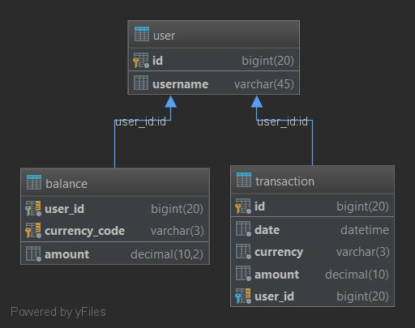

# gRPC Wallet

Project for emulate user electronic wallets for different currency.

##Requirements
* The task consists of a wallet server and a wallet client. 
* The wallet server will keep track of a users monetary balance in the system. 
* There should be separate balance for different currencies.
* The client will emulate users depositing and withdrawing funds.

##Technologies
* Java 8 
* Spring 5.x
* gRPC
* MySQL 5.x
* Gradle
* Hibernate
* Lombok
* Spring Boot 2.1
* Liquibase

##Database schema

##Build application
Run `gradle build` inside the project root directory

###Run wallet server
Type `cd wallet-server` in the project root directory
* create MySql database with name `bpwallet`
* create DB user `bpwalletuser` with password `pwd` and read-write privileges
OR
* change following parameters at `src/maim/resurces/application.properties` file
    * spring.datasource.url
    * spring.datasource.username
    * spring.datasource.password
    * spring.datasource.driver-class-name
* if it needed you can set `grpc.server.threads.number` parameter to change the number of threads in the gRPC requests pool
Type `gradle bootRun` to run server

### Run wallet client
Type `cd wallet-client` in the project root directory
Type `java -jar build/libs/wallet-client.jar`
You can use following CLI params

| Name | Description | Default value |
|:-----|:------------|---------------|
|users |Concurrent users | 100 |  
|concurrent_threads_per_user |Threads per each users | 3 |
|rounds_per_thread |Rounds, each thread executes | 10 |
|start_integration_test |`true` if need to run integration test | `false` |
|start_performance_test |`true` if need to run concurrent test | `true` |

For example:

`java -jar build/libs/wallet-client.jar --users=10 --start_integration_test=true --start_performance_test=false`

##Key features
* use spring-boot-gradle-plugin
* gRPC model store in separate module, entities generate after building
* use gRPC interceptors for logging and measuring performance
* store all users transactions 
